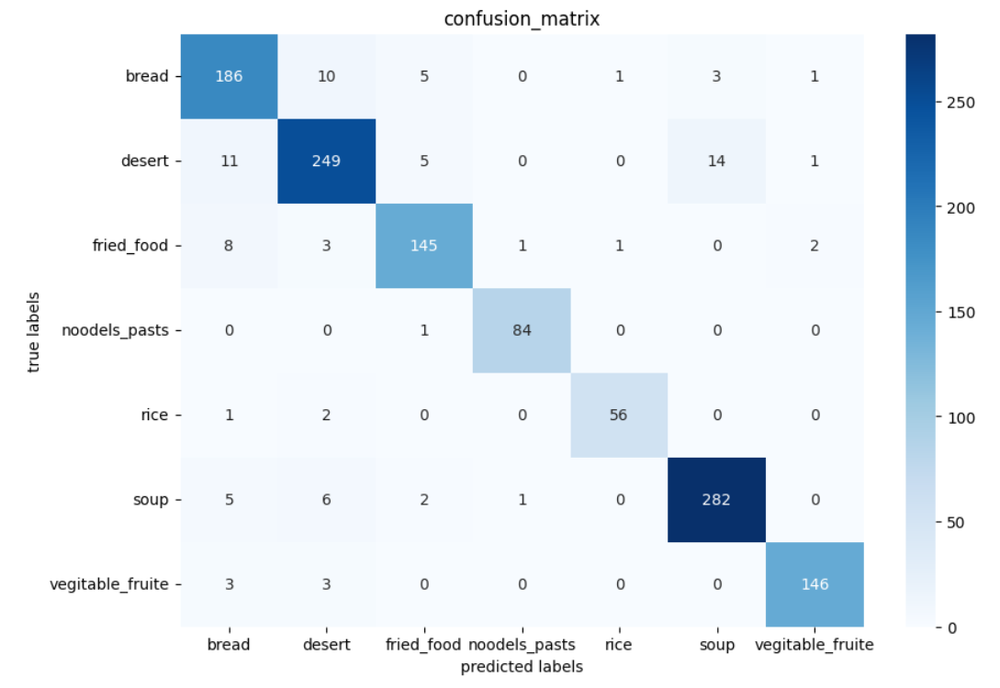
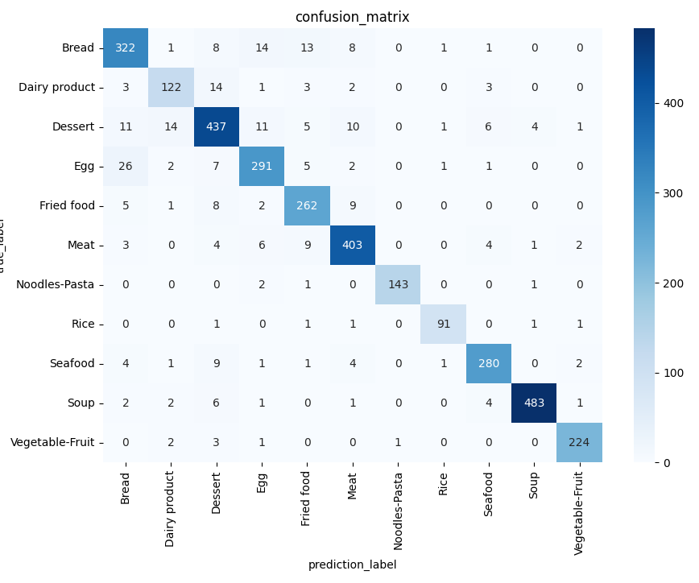

# Food Recognition Model

A deep learning project to classify different food images using CNN.

## 🔍 Project Overview
This project uses image recognition to identify types of food from images. It leverages Convolutional Neural Networks (CNNs) trained on a dataset of labeled food images.

## 🛠️ Technologies Used
- Python
- TensorFlow
- Jupyter Notebook
- google collab

## 🚀 Workflow
1. Collected and cleaned image dataset
2. Preprocessed images (resize, normalize)
3. Trained a CNN model.
4. Evaluated accuracy and loss

## 📊 Results
- Accuracy: 85% on validation set

## 📸 Screenshot

